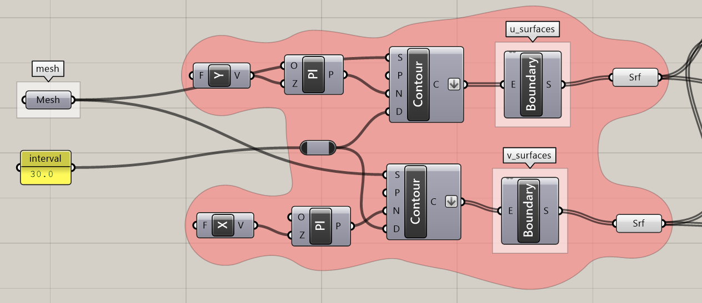
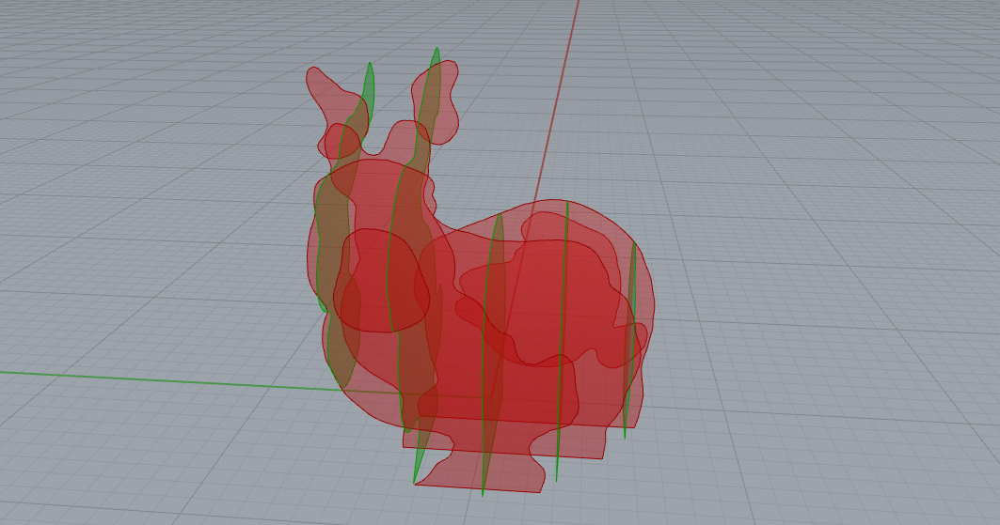
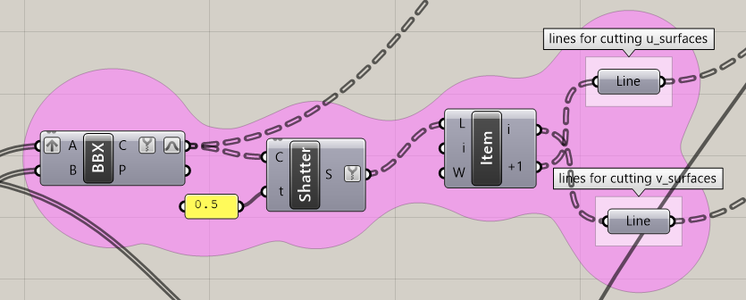
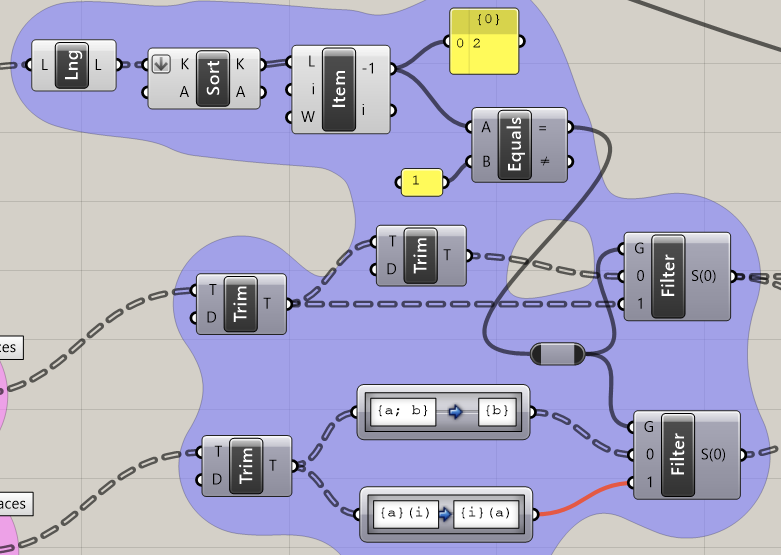
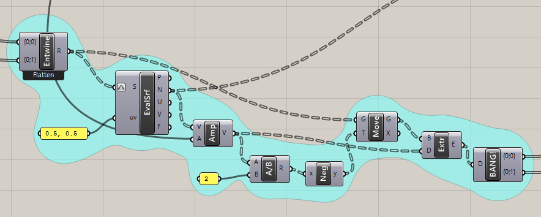
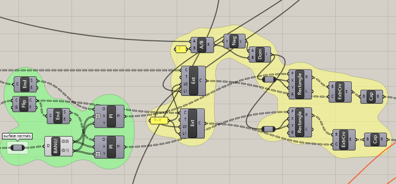
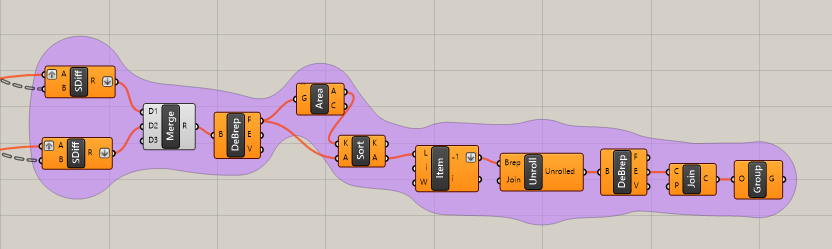

# gh_wafflizer
grasshopper script that creates waffle-like data for laser cutters.

レーザーカッターの導入に伴って、自分の席の「ペン立て」を作る、というワークを行った際に実装したもの。

外形となる三次元モデルを入力すると：
- ワッフル上に板を組んだ状態に変換し
- 交差部の嵌合（相欠き）を生成し
- 投影してレーザーカット用の平面的な加工データを作成

してくれるGrasshopperのスクリプト。

以下の使い方では、Stanford Bunny（https://commons.wikimedia.org/wiki/File:Stanford_Bunny.stl?uselang=ja ）を借りています。

## 使い方と処理の流れ
### 1. ワッフル状に変換
オレンジのブロックにて、ghの**mesh**に*set one mesh*して**contour**で輪切りにしてワッフル状に変換しています。ひとまずここでは**contour**の平面はX軸とY軸で定義してます。また、ペン立て想定なのて輪切りの間隔は30.0mmにしてあり、寸法の大きなメッシュを輪切りする場合は注意のこと。

なお、オレンジのブロックの最後の**surface** に直接Rhinoからサーフェスを入れても動作するはずです。

### 2. 交差部の嵌合の生成
先程作成した二つの輪切りについて、**BBX（Brep | Brep）** して交線を求め、次いで**shgatter**で二等分し、上用、下用に分けておく。

次の紫ブロックがややこしい（し、動作的にちょっと自信がない）ところなのですが…。一つ上のステップで輪切りによってできたサーフェスとそれと交差するサーフェスの交線を求めたわけです。多くの場合、この交線は0本か1本になりますが、サーフェスが複雑なかたちである場合は2本以上になることもあります。

Grasshopperでは、複数のアイテムを持つリストに対しては同じ処理をすると一つ深いパスが作られる`[[A, B],[C, D]]-> [[[A1, A2],[B1, B2]], ...]`）のに対し、
1個しかアイテムの無いリストに対してアイテムを二つに分ける処理を行うとリストの深さが変わらない（`[[A],[B]]-> [[A1, A2],[B1, B2]]`）という処理になるようですので、この紫のブロックはこの処理の違いを吸収するようリスト内のアイテム数をチェック、再構成しています。

このブロックは、輪切りによってできたサーフェスを**Extrude**して厚さ2.5mmの板にするものです。

黄緑と黄色のブロックでは、ちょっとモジャモジャしていますが、紫のブロックで作成した交線と輪切りサーフェスの交線から相欠きを作成するための直方体を作成する処理を行っています。緑のブロックで直方体の作成する際の作業平面を、黄色のブロックで具体的な直方体を作成しています。**Extrude Curve**で直方体化していますが、この際に掃引線をちょっと延長しています。これは、板の厚さを含めると切り欠きの深さ（の直方体の高さ）が不足する場合があるからです。

### 2. 平面に投影して加工用のデータに
最後に**SDiff（Solid Difference）** して、部品形状としたあと、ちょっと無理矢理ですが面積が最大となる面を抽出してから**Unroll Surface** して加工用のデータとしています（今のところレイアウトは手作業）。なお、逐一**SDiff（Solid Difference）** が行われると重いので**Toggle**で調整時はこの処理が行われないようになっています。

## sidenote
ワッフル状に変換→加工はある種レーザーカッター加工の定石なので、もっとうまくやってくれるアドオンがありそうですが、Grasshopperで実装したことがなかったので試作してみました。

## links
* [Stanford Bunny](https://trimsh.org/index.html)